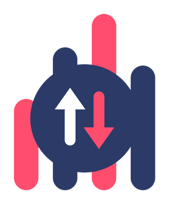

**[🇬🇧 English](README.md)** · 🇮🇹 Italiano

# PeRank

**Sito: [perank.tivustream.com](https://perank.tivustream.com)** · [Informativa privacy](https://perank.tivustream.com/privacy.html)

[](https://addons.mozilla.org/firefox/addon/perank-results-by-relevance/)
&nbsp;

**Pertinenza al posto della pubblicità.** Inverte e riordina i risultati di ricerca,
rimuove gli sponsor e ti aiuta a scavare oltre la prima pagina.


Estensione per Chromium (Chrome, Edge, Brave, Opera) e Firefox che, sulla pagina dei risultati dei principali motori di ricerca:

- **rimuove gli annunci / risultati sponsorizzati**;
- **riordina i risultati mostrati** in tre modalità — *Originale*, *Inverti*, *Pertinenza* (con badge di punteggio e spiegazione dei criteri al passaggio del mouse);
- offre, dove possibile, una **ricerca profonda opt-in** per andare oltre la prima pagina (vedi sezione dedicata: cosa aspettarsi, motore per motore).

Lavora **solo sui risultati già presenti nella pagina**: nessuna richiesta automatica, nessuno scraping, nessun rischio di ban o violazione dei termini d'uso. La ricerca profonda è sempre un'azione esplicita dell'utente.

## Motori supportati

Google, Bing, DuckDuckGo, Startpage, Yandex, Brave Search, Ecosia, Yahoo. L'addon rileva da solo su quale motore ti trovi e applica l'adapter giusto.

## Ricerca profonda: cosa aspettarsi (e perché)

Le funzioni principali — **inversione**, **riordino per pertinenza** e **rimozione degli sponsor** —
funzionano su **tutti e 8** i motori supportati. La "ricerca profonda" (andare oltre la prima pagina)
dipende invece da cosa ciascun motore consente di fare in modo pulito, quindi il comportamento cambia:

| Motore | Profondità |
|---|---|
| **Ecosia** | **In pagina**: il pulsante "Carica altri" aggiunge i risultati delle pagine successive in una sezione dedicata, riordinata. |
| **Google, Bing, Yandex, Yahoo** | **Nuova scheda**: un invito discreto propone di rilanciare la stessa ricerca su un motore aperto, dove i risultati sono spesso molto diversi. |
| **DuckDuckGo, Brave, Startpage** | **Non disponibile.** Nessun pulsante viene mostrato. |

Perché su DuckDuckGo, Brave e Startpage non c'è: questi motori non espongono un modo affidabile per
caricare le pagine successive (DuckDuckGo non ha una paginazione via URL, Brave ignora i parametri di
offset e carica solo con lo scroll interno, Startpage maschera i link dietro un proxy e usa una
paginazione con token di sessione). Si potrebbe forzare la mano con espedienti fragili, ma abbiamo
preferito **non mostrare un pulsante che non mantiene la promessa**: meglio nessuna funzione che una
funzione che inganna. Se in futuro uno di questi motori cambierà, la aggiungeremo.

## Installazione

**Firefox — [scaricala da Mozilla Add-ons](https://addons.mozilla.org/firefox/addon/perank-results-by-relevance/)** (revisionata e firmata).
Chrome / Edge / Brave: presto sul Chrome Web Store (in revisione). Nel frattempo usa la modalità sviluppatore qui sotto.

### Modalità sviluppatore (Chromium)

1. Apri il browser su `chrome://extensions` (o `brave://extensions`).
2. Attiva **Modalità sviluppatore** (in alto a destra).
3. Clicca **Carica estensione non pacchettizzata**.
4. Seleziona la cartella `perank`.
5. Fai una ricerca su uno dei motori supportati: comparirà la barra **PeRank** sopra i risultati.

## Installazione su Firefox (temporanea, per test)

1. Apri `about:debugging#/runtime/this-firefox`.
2. Clicca **Carica componente aggiuntivo temporaneo**.
3. Seleziona il file `manifest.json` nella cartella `perank`.
4. Fai una ricerca su uno dei motori supportati.

Nota: in Firefox il caricamento temporaneo dura fino alla chiusura del browser. Per un'installazione
permanente serve la firma di Mozilla via AMO (vedi PROMEMORIA_DISTRIBUZIONE.md). Il manifest include
gia' `browser_specific_settings.gecko` necessario per Firefox.

## Impostazioni

Clicca l'icona dell'estensione per: ordinamento predefinito, motore di ricerca profonda (DuckDuckGo / Brave / SearXNG), se ignorare le parole comuni, le **liste blacklist/whitelist**, i **voti sui domini** e le **gemme salvate**.

### Liste blacklist/whitelist

- **Blacklist**: domini sempre nascosti dai risultati (un dominio per riga).
- **Whitelist**: domini con priorità nel punteggio di pertinenza.

Dopo aver salvato, ricarica la pagina dei risultati.

### Feedback 👍/👎 e gemme ⭐

Accanto a ogni risultato compaiono tre piccoli pulsanti:

- **👍 / 👎** — votano il **dominio**, non il singolo link: tutti i risultati di quel sito salgono
  (o scendono) nel punteggio di pertinenza. Sono a scatto: ricliccando si annulla il voto.
- **⭐** — salva il risultato tra le **gemme**, un archivio personale utile per non perdere le risorse
  buone pescate in profondità. Ricliccando si rimuove.

Il voto ha un peso forte nel punteggio (±30): un sito promosso risale in modo netto in modalità
*Pertinenza*, uno declassato affonda. L'effetto è immediato, senza bisogno di ricaricare.

Dal **popup** dell'estensione si gestisce tutto:

- **Voti sui domini** — due elenchi distinti, *👍 Promossi* e *👎 Declassati*, con la ✕ accanto a ogni
  dominio per rimuovere il singolo voto, e "Azzera tutto" per ripartire da zero.
- **⭐ Gemme salvate** — elenco cliccabile con motore, data e URL di ogni risultato salvato, la ✕ per
  rimuoverne uno e "Svuota" per cancellarle tutte.

**Tutto resta in locale sul dispositivo**: voti e gemme sono nello storage dell'estensione, non
esiste alcun server e nessun dato viene inviato altrove.

## Lingue

PeRank è **bilingue: italiano e inglese**. Nel popup, in cima, c'è un selettore **Lingua** con tre
opzioni: *Automatica* (segue la lingua dell'interfaccia del browser, è il default), *Italiano* e
*English*. Chi ha il browser in una lingua diversa dalle due vede l'inglese.

Dopo aver cambiato lingua, **ricarica la pagina dei risultati** perché anche la barra in pagina si
aggiorni: il popup invece cambia subito.

> Nota: la modalità *Automatica* segue la lingua dell'**interfaccia** del browser, non quella dei
> contenuti web. Su Windows, Chrome e Brave la ereditano dal sistema operativo, quindi può non
> bastare modificarla nelle impostazioni del browser. Il selettore serve anche a questo.

### Come sono organizzate le traduzioni

- `_locales/<lingua>/messages.json` — **unica fonte di verità**. Servono al manifest e alle schede
  degli store, dove nome e descrizione appaiono già localizzati.
- `i18n-data.js` — file **generato**, non va modificato a mano. Permette la scelta manuale della
  lingua, che l'API `chrome.i18n` da sola non consente (non è sovrascrivibile a runtime).

Per aggiungere una lingua: copia `_locales/en/` in `_locales/<codice>/`, traduci i valori `message`,
poi rigenera il file dati:

```
python3 tools/build-i18n.py
```

Infine aggiungi l'opzione nel selettore in `popup.html`. Nessun'altra modifica al codice.

## Architettura (per estendere)

Il **core** (tokenizzazione, punteggio, riordino, badge, UI, nota) è **indipendente dal motore**. Ogni motore è definito da una sola voce nell'array `ENGINES` dentro `content.js` (host, selettori dei risultati, del titolo, degli annunci). Per aggiungere un nuovo motore: aggiungi una voce a `ENGINES` e il suo dominio in `manifest.json`. Nient'altro.

## Nota sui selettori

Il markup dei motori cambia spesso ed è spesso offuscato. Google è stato testato dal vivo; i selettori degli altri motori sono basati sulle strutture note e potrebbero richiedere una piccola rifinitura al primo test reale — si modifica solo la voce corrispondente in `ENGINES`.

## Struttura

- `manifest.json` — configurazione MV3 + domini dei motori + icone
- `content.js` — core + configurazione motori (`ENGINES`) + adapter generico
- `content.css` — stile della UI iniettata
- `popup.html` / `popup.js` — pannello impostazioni
- `_locales/` — traduzioni (`en`, `it`) — fonte di verità
- `i18n-data.js` — traduzioni generate (non modificare a mano)
- `tools/build-i18n.py` — rigenera `i18n-data.js` da `_locales/`
- `icons/` — icone dell'estensione (16, 32, 48, 96, 128 px)
- `brand/` — sorgenti SVG del marchio e del logo, PNG promozionali, palette colori

## Limiti noti (è un MVP)

- Il riordino sposta i blocchi che condividono lo stesso contenitore del primo risultato; sezioni speciali (box "Le persone hanno chiesto anche", caroselli, ecc.) non vengono riordinate.
- Testato sul layout desktop. Mobile e rifinitura selettori dei singoli motori nelle prossime iterazioni.
- `&num=100` è stato rimosso da Google (set. 2025): per questo la profondità passa dal rilancio su motore aperto, non dal gonfiare la pagina.
- **Yandex: rimozione degli sponsor non verificata.** Riordino, punteggio di pertinenza, voti e gemme funzionano regolarmente. Non siamo però riusciti a far comparire un annuncio in nessuna delle ricerche di prova sul dominio internazionale, quindi non abbiamo potuto validare i selettori pubblicitari dal vivo. Preferiamo dichiararlo invece di scrivere un selettore "a occhio": uno troppo largo nasconderebbe risultati legittimi. Yandex offusca inoltre le classi CSS a ogni build, quindi è il motore per cui è più probabile servano ritocchi nel tempo.

## Licenza

PeRank è software libero, rilasciato sotto **GNU General Public License v3.0**.
Puoi usarlo, studiarlo, modificarlo e ridistribuirlo; se ne distribuisci una versione modificata,
devi rilasciarne il sorgente sotto la stessa licenza. Testo completo nel file `LICENSE`.

## Privacy

PeRank **non raccoglie e non invia alcun dato**. Non esiste un server: impostazioni, voti sui domini
e gemme salvate restano nello storage locale del browser, sul tuo dispositivo. L'unica connessione di
rete è quella che apri tu esplicitamente cliccando "Carica altri" o "Altri risultati".

## Parte della suite TivuStream

PeRank fa parte di [TivuStream](https://tivustream.com), piattaforma di strumenti privacy-first.
